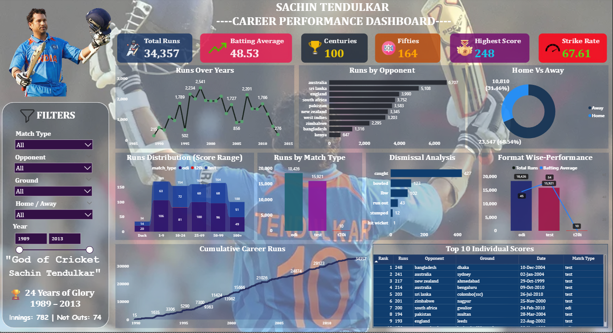

# Sachin_Career_Analytics_Project

## Cricket Data Analytics Project
An end-to-end cricket data analytics project analyzing Sachin Tendulkar’s international career statistics using Python, SQL Server, and Power BI. This project focuses on data cleaning, exploratory data analysis, SQL-based business problem solving, and interactive dashboard visualization.

# Dashboard Preview

# Project Overview

This project analyzes innings-level batting records of Sachin Tendulkar from 1989 to 2013 across all international formats including Test, ODI, and T20I cricket.

The workflow covers:

* Data Cleaning using Python & Pandas
* Feature Engineering
* SQL Analysis using SQL Server
* Power BI Dashboard Development
* Cricket Performance Insights & Visualization

The project demonstrates a complete end-to-end data analytics pipeline from raw dataset to business insights.

# Dataset Information

* **Dataset Source:** ESPN Cricinfo
* **Career Span:** 1989 – 2013
* **Total Innings:** 782
* **Formats Covered:** Test, ODI, T20I

## Key Dataset Columns

* Runs
* Balls Faced
* Strike Rate
* Fours
* Sixes
* Opponent
* Ground
* Match Type
* Dismissal
* Career Phase
* Home/Away
* Year & Month

# Tools & Technologies Used

| Tool                | Purpose                   |
| ------------------- | ------------------------- |
| Python              | Data Cleaning & EDA       |
| Pandas              | Data Manipulation         |
| NumPy               | Numerical Operations      |
| SQL Server          | Data Analysis             |
| SQLAlchemy + pyodbc | Python to SQL Export      |
| Power BI            | Dashboard & Visualization |
| Jupyter Notebook    | Development Environment   |

# Project Workflow

## 1. Data Cleaning (Python)

Performed 20+ cleaning operations including:

* Removing unnecessary columns
* Standardizing column names
* Handling missing values
* Cleaning text values
* Converting data types
* Feature engineering
* Home/Away classification
* Career phase classification
* Strike rate calculation
* Duplicate removal

## 2. SQL Analysis

Solved multiple business questions using SQL queries:

* Career summary statistics
* Format-wise performance
* Opponent analysis
* Venue analysis
* Home vs Away comparison
* Dismissal patterns
* Score distribution
* Year-wise performance trends
* Cumulative career runs
* Consistency analysis using STDEV

## 3. Power BI Dashboard

Created an interactive cricket analytics dashboard with:

* KPI Cards
* Line Charts
* Bar Charts
* Donut Charts
* Area Charts
* Interactive Filters & Slicers

Dashboard features include:

* Match Type filtering
* Opponent filtering
* Ground filtering
* Home/Away comparison
* Year range analysis

# Dashboard Features

* KPI Cards for Runs, Average, Centuries, Fifties, Highest Score, and Strike Rate
* Runs Over Years trend analysis
* Opponent-wise performance comparison
* Home vs Away performance split
* Match format comparison (Test, ODI, T20I)
* Dismissal analysis
* Score distribution analysis
* Cumulative career runs tracking
* Interactive slicers and filters

# Key Insights

* **Total Runs:** 34,357
* **Centuries:** 100
* **Half-Centuries:** 164
* **Highest Score:** 248
* **Career Average:** 48.53
* **Overall Strike Rate:** 67.61
* **Top Opponent:** Australia
* **Peak Year:** 1998

# Repository Structure

Sachin-Tendulkar-Career-Analysis/
│
├── dataset/
│   └── sachin_perfomance.csv
│
├── notebook/
│   └── Sachin Tendulkar Career Data Cleaning.ipynb
│
├── sql_queries/
│   └── sachin_career_analysis_project.sql
│
├── powerbi_dashboard/
│   └── Sachin.pbix
│
├── report/
│   └── Sachin_Tendulkar_Career_Analysis_Report.pdf
│
├── presentation/
│   └── Sachin_Tendulkar_Career_Analysis_Presentation.pdf
│
├── README.md
├── LICENSE
└── .gitignore

# Future Improvements

* Machine Learning based performance prediction
* Player comparison analytics
* Advanced cricket statistics
* Live match data integration
* Web dashboard deployment

# Conclusion

This project demonstrates a complete data analytics workflow using real-world cricket data. It combines Python, SQL Server, and Power BI to extract meaningful insights from Sachin Tendulkar’s legendary international career and present them through interactive visualizations.

The project showcases data cleaning, SQL analysis, dashboard development, and business insight generation using modern analytics tools and technologies.

# Disclaimer

This project is created for educational and portfolio purpose only. Cricket statistics data is sourced from publicly available records.

# Author

## Miryala Yashwanth Raj

* Python
* SQL
* Power BI
* Data Analytics
